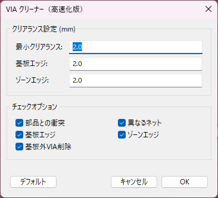

# KiCad ビアクリーナープラグイン


**ビアクリーナー**は、KiCadのPCB設計から不要または問題のあるビア（VIA）を削除するためのプラグインです。部品、異なるネット、基板エッジ、ゾーンとの衝突をチェックし、指定したクリアランスルールに準拠するようにPCBレイアウトを整理します。このプラグインは**KiCad 9.0.2**向けに設計されており、一部の制限付きで以前のバージョンでも動作する可能性があります。

## 機能
- 以下の条件に該当するビアを削除：
  - 部品と衝突しているビア。
  - 異なるネットと干渉しているビア。
  - 基板エッジやゾーンに近すぎるビア。
  - 基板の外側に配置されているビア。
- 部品、基板エッジ、ゾーンに対するクリアランス設定をカスタマイズ可能。
- 使いやすいGUIでチェックオプションを自由に選択可能。
- キャッシュを利用した高速処理と効率的な衝突検出。

## インストール方法
1. **プラグインのダウンロード**：
   - このリポジトリをクローンするか、ZIPファイルをダウンロードします：
     ```bash
     git clone https://github.com/[YourGitHubUsername]/kicad-via-cleaner.git
     ```
2. **ファイルのコピー**：
   - `via_cleaner.py`ファイルと`via_cleaner.png`アイコンをKiCadのプラグインディレクトリにコピーします：
     - **Windows**: `C:\Users\[YourUsername]\AppData\Roaming\kicad\9.0\plugins\`
     - **Linux**: `~/.local/share/kicad/9.0/plugins/`
     - **macOS**: `~/Library/Application Support/kicad/9.0/plugins/`
3. **KiCadの再起動**：
   - KiCadのPCBエディタを起動すると、プラグインがツールバーまたは「ツール > 外部プラグイン」メニューに表示されます。

## 使用方法
1. KiCadのPCBエディタでPCBプロジェクトを開きます。
2. チェックしたいビア（またはビアを含むグループ）を選択します。
3. ツールバーの**ビアクリーナー**アイコンをクリックするか、「ツール > 外部プラグイン」メニューからアクセスします。
4. ダイアログで設定を調整：
   - **最小クリアランス**：ビアと他の要素間の最小距離（mm）。
   - **基板エッジクリアランス**：基板エッジからの最小距離（mm）。
   - **ゾーンエッジクリアランス**：ゾーンエッジからの最小距離（mm）。
   - **チェックオプション**：部品、ネット、基板エッジ、ゾーン、基板外ビアのチェックを有効/無効に設定。
5. **OK**をクリックして問題のあるビアを削除します。
6. 結果メッセージで削除されたビアの数と処理時間を確認します。

## スクリーンショット


## 互換性
- **テスト済み**: KiCad 9.0.2
- **部分的互換性**: KiCad 6.xおよび7.x（APIの違いにより、ゾーン距離計算などの一部機能が動作しない場合があります）。
- **依存関係**: `wxPython`（KiCadに同梱）。

## 既知の問題
- 古いKiCadバージョンでは、ゾーン距離計算がAPIの制限により失敗する可能性があります。
- 基板のEdge.Cutsレイヤーが正しく定義されていない場合、基板アウトライン検出が機能しないことがあります。
- 問題や機能リクエストは[Issues](https://github.com/[YourGitHubUsername]/kicad-via-cleaner/issues)セクションで報告できますが、対応はほぼ行えません。

## ⚠️ 制約事項・注意点

- **CC0ライセンス**: パブリックドメインで提供されています
- **個人開発**: サポートは期待できません
- **四角形以外の領域**: 複雑な形状のゾーンは未検証です
- **バックアップ推奨**: 使用前に必ずプロジェクトのバックアップを取ってください
- **大量VIA**: 大量のVIA削除時には重くなります
- **DRCチェック**: 錯書後は必ずDRCチェックを実行してください

## 🔄 更新履歴

### V1.0.0
- 初版(2025/05/21)
### V1.0.1 
- VIA削除のバグを解消、高速化(2025/05/22)

## 📄 ライセンス

CC0 1.0 Universal (CC0 1.0) Public Domain Dedication

このプラグインは無料で提供されており、**寄付は一切不要**です。
自由にご利用、改変、再配布してください。

## ⚖️ 免責事項

このプラグインの使用により発生したいかなる損害についても、開発者は責任を負いません。
使用は自己責任でお願いします。必ず使用前にプロジェクトのバックアップを取ってください。

---

*KiCad VIAステッチングプラグイン - より効率的なPCB設計のために*